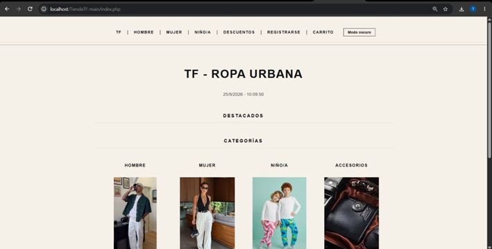
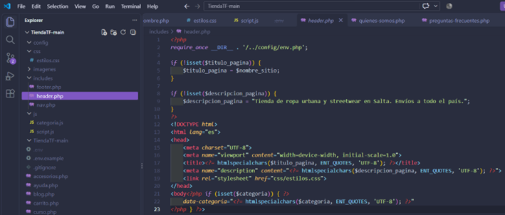
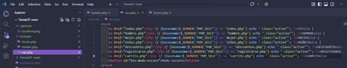
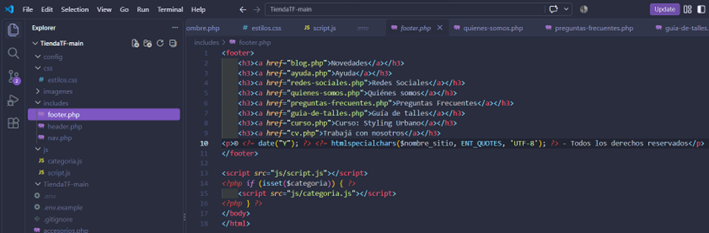
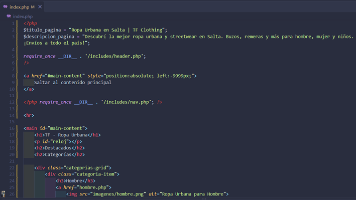
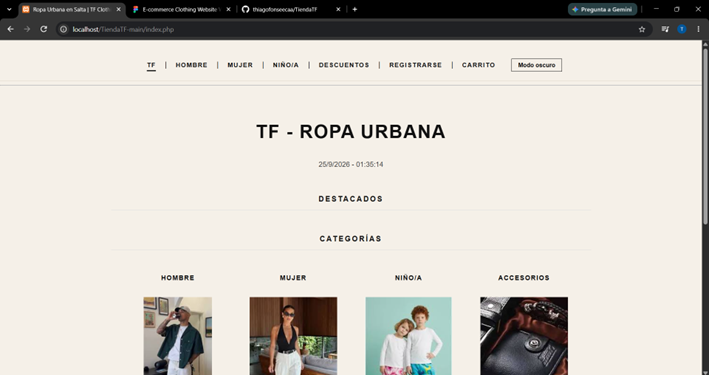
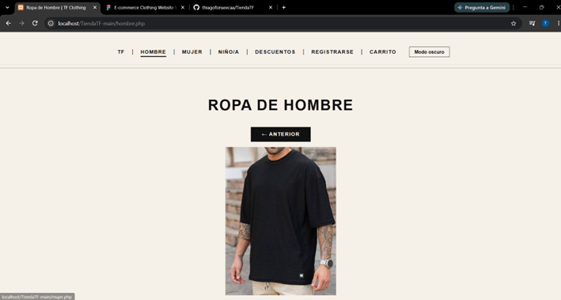
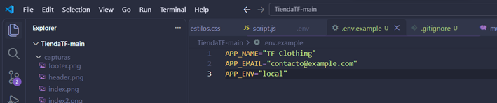

# TF Clothing — Trabajo Práctico N° 4

Tienda de ropa urbana de Salta desarrollada para la materia Programación Web.

En este trabajo migré las 16 páginas de HTML a PHP y separé el encabezado, el menú y el pie de página en archivos compartidos. También incorporé títulos dinámicos, el resaltado de la sección actual y la configuración mediante un archivo .env.

## Prototipo original

[Ver el diseño en Figma](https://www.figma.com/make/tv5U9vIkVLTHbOQ5vmi3XA/E-commerce-Clothing-Website-Wireframes)

El prototipo corresponde al diseño inicial. La apariencia del sitio fue cambiando durante el desarrollo.

## Tecnologías utilizadas

- HTML5
- CSS3
- JavaScript
- PHP 8.2
- XAMPP y Apache
- Git y GitHub

## Instalación y ejecución local

1. Instalar XAMPP con PHP 8.x.
2. Abrir una terminal dentro de C:\xampp\htdocs y clonar el repositorio:

   git clone https://github.com/thiagofonseecaa/TiendaTF.git TiendaTF-main

3. Copiar .env.example y renombrar la copia como .env en la raíz del proyecto.
4. Completar APP_NAME, APP_EMAIL y APP_ENV en .env.
5. Iniciar Apache desde el panel de XAMPP.
6. Abrir http://localhost/TiendaTF-main/index.php en el navegador.

El sitio debe ejecutarse mediante Apache para que PHP procese las páginas.

## Organización del proyecto

- includes/header.php: estructura inicial, metadatos, título y hoja de estilos.
- includes/nav.php: menú compartido y clase active según la página actual.
- includes/footer.php: enlaces del pie, año actual, nombre del sitio y scripts.
- config/env.php: lectura de la configuración.
- css/: estilos del sitio.
- js/: interacciones, formulario, modo oscuro y galerías.
- imagenes/: imágenes utilizadas.
- capturas/: evidencias del trabajo.
- Archivos .php en la raíz: contenido de las 16 páginas.

Las páginas utilizan require_once para incorporar las plantillas.

## Configuración

El archivo .env contiene estas variables:

- APP_NAME: nombre del sitio.
- APP_EMAIL: correo de contacto.
- APP_ENV: entorno de ejecución, configurado como local.

config/env.php lee estos valores con parse_ini_file.
El nombre configurado se utiliza en el pie de página y como título predeterminado.

.env está excluido mediante .gitignore.
.env.example se incluye como plantilla para ejecutar el proyecto en otra computadora.

## Funcionalidades

- Títulos generados con PHP mediante $titulo_pagina.
- Menú con la sección actual subrayada.
- Plantillas compartidas entre las páginas.
- Año del pie generado con PHP.
- Modo oscuro.
- Galerías de productos con ampliación de imágenes.
- Preguntas frecuentes desplegables.
- Saludo de bienvenida una vez por sesión de pestaña al entrar al inicio.
- Validación básica y resumen del formulario con JavaScript.

El registro y el carrito forman parte de la maqueta. No se guardan usuarios ni se procesan compras.

## Capturas de funcionamiento

### Sitio ejecutándose en localhost

### Plantillas compartidas

### Integración en la página de inicio

### Navegación dinámica

### Plantilla de configuración

## Control de versiones

La migración se trabajó en la rama feature/migracion-php-ssi,
con commits separados para las plantillas, su integración y la configuración.